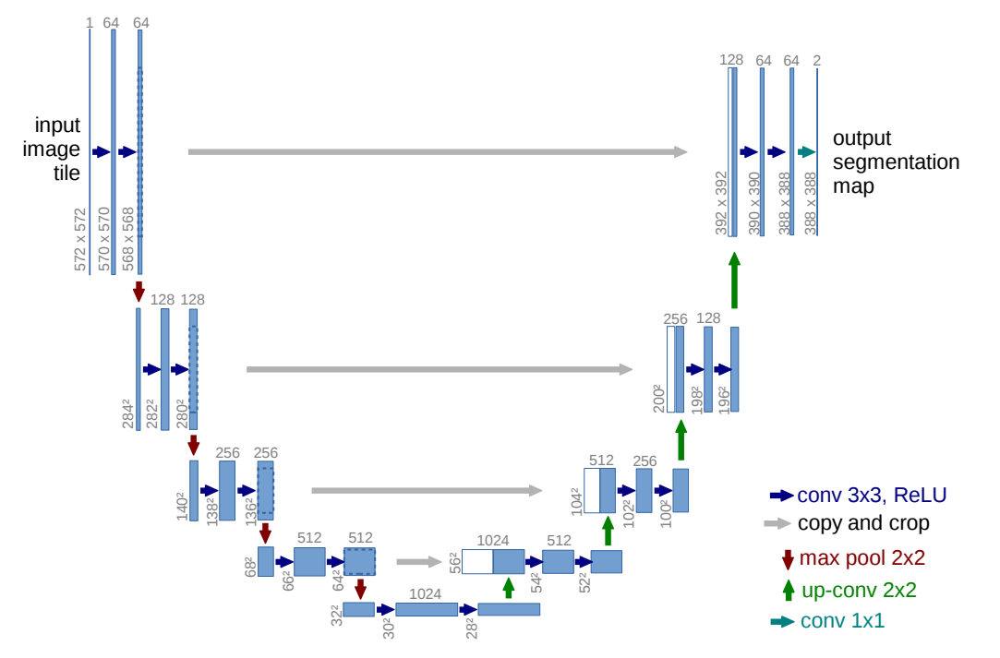

# 🚀 흉부 X-ray Segmentation

## 📌 소개  
이 프로젝트는 **AI 의료바이오 부트캠프 과정 중 진행한 연구 프로젝트**로,  
**위(胃)와 폐(肺) 세분화(Segmentation) 모델 개발**을 목표로 합니다.  

---

### 🔍 연구 목적
의료 영상 분석에서 **흉부 X-ray**는 폐 질환(예: 폐렴, 결핵, 폐암 등)의 진단에 널리 사용됩니다.  
정확한 **위 및 폐 영역 분할(Segmentation)** 은 다음과 같은 의료적 활용이 가능합니다:

✅ **자동화된 진단 지원** → X-ray 영상에서 폐 영역을 분리하여 질환을 빠르게 감지  
✅ **정량적 분석** → 폐 크기, 병변 부위 면적 등을 정량화하여 환자 상태 추적  
✅ **수술 계획 및 치료 평가** → 치료 전후의 변화를 정밀 분석  

본 연구에서는 병원에서 제공된 **흉부 X-ray 데이터셋**을 활용하여,  
**딥러닝 기반 U-Net 모델을 이용한 폐 및 위의 자동 세분화(Segmentation) 모델**을 구축합니다.

---

## 📝 개요
이 프로젝트는 **폐 X-ray 이미지에서 폐 및 관련 구조를 세분화(Segmentation)하는 U-Net 기반의 딥러닝 모델**을 구축하는 것입니다.  

주어진 X-ray 이미지를 처리하고, U-Net 모델을 학습시켜 마스크(ground truth)와 비교하여 성능을 평가합니다.

**논문에서 제안된 U-Net 아키텍처**를 기반으로 모델을 설계하였습니다.

---

### 📖 참고 논문
[U-Net: Convolutional Networks for Biomedical Image Segmentation](https://arxiv.org/abs/1505.04597)  

### 📌 U-Net 아키텍처 구조

## 

